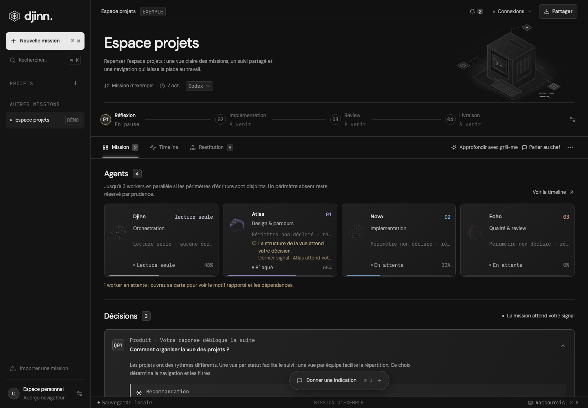
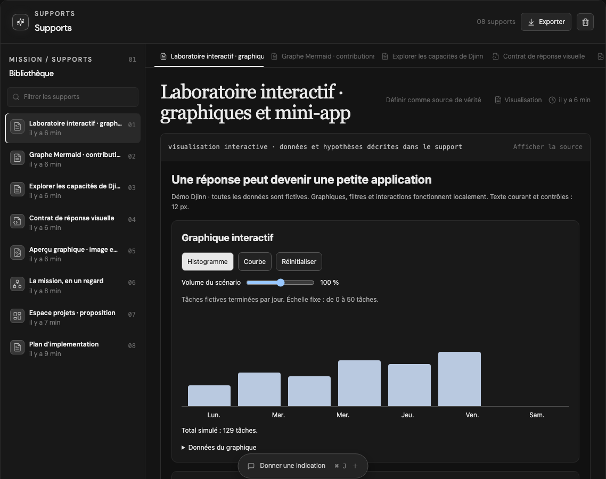

# Djinn

> **ALPHA — NON UTILISABLE EN L’ÉTAT.** Djinn est un projet expérimental en cours de développement. Il n’est pas prêt à être utilisé, ni pour un travail réel ni en production. Les fonctionnalités décrites ci-dessous présentent l’objectif du projet et son état de développement ; elles ne constituent pas une garantie de fonctionnement.

**Donnez une intention. Gardez la main sur le travail de vos agents.**

Djinn est une application de bureau locale pour travailler avec **Codex** et **Claude Code** : une timeline lisible, des agents suivis en direct, des décisions explicites et des résultats que vous pouvez ouvrir, annoter et valider.



## Du brief au résultat

- **Une mission, un parcours.** Exploration, réflexion, spécification, prototype, implémentation, review et livraison, avec un workflow libre ou préparé.
- **Une équipe visible.** Suivez le chef et ses workers, leurs périmètres, dépendances, conversations et activités réelles.
- **Des résultats utilisables.** Documents Markdown, diagrammes, wireframes et visualisations interactives restent dans la mission.
- **Vous décidez.** Répondez aux questions, donnez une indication, annotez les supports et validez les résultats.
- **Une reprise sans repartir de zéro.** Le tag du fournisseur se déplie : choisissez Codex ou Claude Code, puis **Changer et reprendre** après un arrêt ou un quota épuisé. Les fichiers, décisions, supports et l’historique sont conservés.
- **Une notification à chaque étape réussie.** Cliquez dessus pour retrouver le résultat. Projets et missions affichent les plus récents en haut.



_Captures de la démonstration intégrée, avec des données fictives._

## Développement local de l’alpha

Ces commandes sont destinées aux contributeurs qui souhaitent explorer ou développer cette version expérimentale.

```sh
npm ci
npm run desktop
```

Installez et connectez au moins une CLI : Codex ou Claude Code. Djinn utilise votre connexion locale au fournisseur ; aucune clé API n’est demandée dans l’application.

La mission **Espace projets** permet d’explorer l’interface sans appeler de modèle ni modifier un projet. Les autres parcours sont en cours de développement.

### Construire l’application

```sh
npm run build
npm start
```

Créer un paquet local macOS :

```sh
npm run package:local
npm run verify:local-package
```

Le bundle est placé dans `release/v<version>/mac-arm64/Djinn.app`. Pour préparer une mise à jour pendant qu’une ancienne version travaille, utilisez `DJINN_PACKAGE_SUFFIX=recovery` avec ces deux commandes, puis ouvrez le nouveau paquet après avoir arrêté l’ancienne instance.

## Vos projets restent locaux

L’état est sauvegardé dans le répertoire utilisateur Electron. Une pause conserve le contexte ; l’export `.djinn.json` permet de reprendre une mission sur une autre machine. Les validations humaines restent explicites, y compris pour la review et la livraison. Les permissions des CLI restent actives.

Les sorties d’outils affichées dans l’historique sont bornées pour éviter de saturer la sauvegarde. Le journal de mission conserve les sorties complètes ; les anciennes sauvegardes volumineuses sont compactées avec une copie de secours avant leur remplacement.

Les sorties de compilation, bundles, caches, logs et exports historiques sont exclus de Git. Le dépôt inclut uniquement la petite session de démonstration nécessaire aux tests.

## Vérifier

```sh
npm test
npm run build
npm run test:e2e
node scripts/electron-smoke.cjs
```

Les tests natifs utilisent des fournisseurs contrôlés ; les tests Chromium exercent l’interface, la reprise et les supports. Ils n’appellent pas de modèle payant.

[Guide d’utilisation](docs/guide-utilisation.md) · [Protocole des agents](docs/agent-protocol.md) · [Vérification de la version 0.2.1](docs/v0.2.1-completion.md)

## Crédits

Le moteur et certains adaptateurs sont étudiés à partir de [T3 Code](https://github.com/pingdotgg/t3code). Les avatars utilisent [Thinking Orbs](https://libraries.dev/orbs). Les diagrammes et illustrations de Djinn sont originaux. Voir [les notices](THIRD_PARTY_NOTICES.md) et [la licence](LICENSE).
