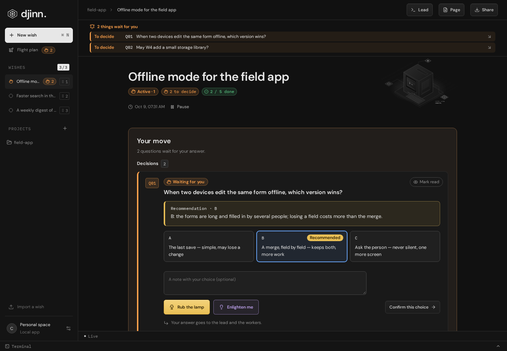
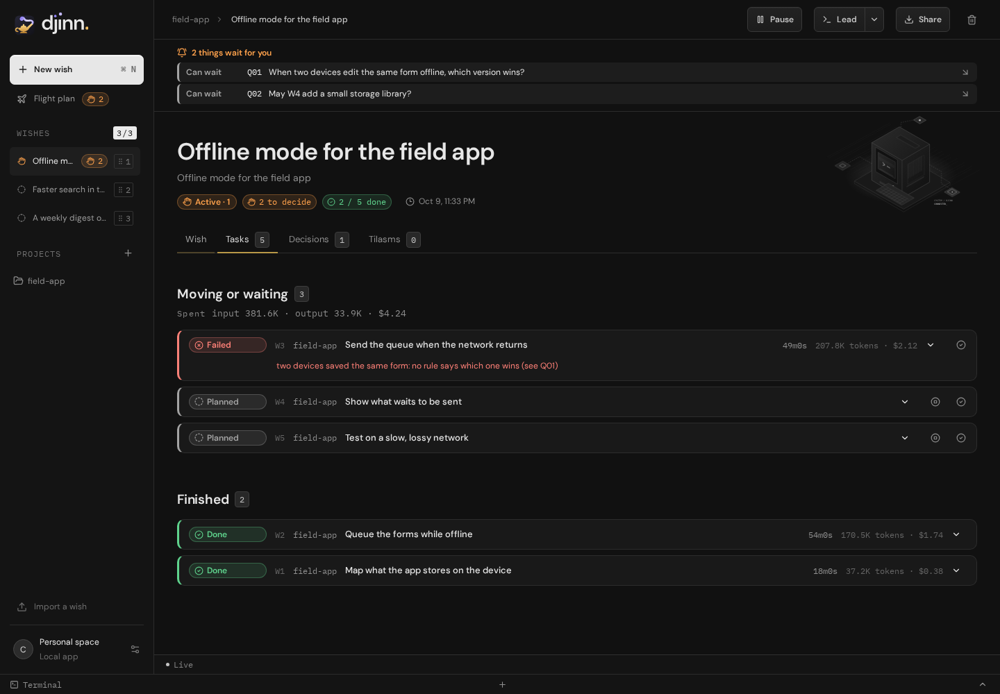

# Djinn user guide

How to get going with Djinn, then use its flight plan day to day. Djinn is one command, `djinn`: a window, a local
server, and a command line your agents use to drive a wish. You say what you wish; a lead (Claude Code, Codex or
Antigravity) splits it into tasks; workers do them; you answer the questions and grant the wish.

> **Alpha.** Djinn is under development: see the warning at the top of the [README](../README.md).

<picture>
  <source media="(prefers-color-scheme: light)" srcset="screenshots/readme/questions-light.png">
  
</picture>

## Install

The one-line install is in the [README](../README.md#install); it works once the first release is out. Until then,
build Djinn from this repository: [`CONTRIBUTING.md`](../CONTRIBUTING.md#getting-set-up).

Workers and leads run the agents you already have, as you installed and signed in to them:

- Codex: `npm install -g @openai/codex`
- Claude Code: `npm install -g @anthropic-ai/claude-code`
- Antigravity, optional: [`providers.md`](providers.md#antigravity).

**Connections & preferences** (bottom of the side panel) shows which command lines Djinn finds. Djinn asks for no API
key, and stores none: the account each agent signs in with pays for it.

## Start Djinn: `djinn up`

```sh
djinn up              # the window
djinn up --browser    # no window: prints the URL to open in your browser
```

- **One Djinn per data folder.** A second `djinn up` brings the running window to the front.
- **The data folder.** It is `djinn` in your system's configuration folder (`~/.config/djinn` on Linux,
  `~/Library/Application Support/djinn` on macOS, `%AppData%\djinn` on Windows). `DJINN_HOME` sets another one.
- **Closing the window does not stop Djinn.** The lead and the workers go on. To quit: "Quit Djinn" in the tray menu,
  Ctrl+Q (Cmd+Q on macOS), or stop `djinn up`.
- **How many workers at once.** The machine decides: one per 2 cores and per 2 GiB of memory.
  `djinn up --workers 4` (1 to 16) sets it. The status bar shows `Workers 2/4`, and whether the page is `Live`.

### The terminal

The window has a terminal at the bottom. It opens in the folder of your first project (the first of the side panel),
never in your home folder: an agent started there would ask you to trust all of it. With no project yet, the terminal
asks you to create one. `djinn up --terminal-dir <folder>` picks another folder, and
`djinn up --terminal "…" --terminal-dir <folder>` runs that command instead of your shell.

It holds tabs. The window's own terminal is always there; while the wish you look at has a lead running, its tab,
**Lead · <wish>**, is there too. The + of the tab bar, or Ctrl+Shift+T anywhere in the window, opens a new shell
(**Shell 1**, **Shell 2**…); the terminal icon next to a project in the side panel opens one at its root. Each tab you
opened closes with its ×, and comes back after a reload. The terminal folds away; **Restart** starts one again once
its program ended. Ctrl+Shift+C and Ctrl+Shift+V copy and paste.

## A project

A project is a folder Djinn's workers work in. Git or not: a folder outside Git works too.

- In the window: **Create a project** (the + next to PROJECTS), then the folder (**Choose a folder…** in the window;
  type the path in the browser) and, optionally, a name.
- From a terminal: `djinn project add <folder>`.

Click a project to see its folder, whether it is a Git repository, its remote and its skills, those summoned from
another project included ("from app"). `djinn skill summon app/babysit-mr --into infra` lets infra's workers use a
skill of app without a copy.

## A wish

**New wish** (top of the side panel) opens **Make a wish**: what you wish, in a sentence, and the projects it works
on. Or from a terminal, or from your lead: `djinn wish make "…"`. Under the wish's title, a click gives it the few
lines it opens with: what it is for, its scope, where it goes (`djinn wish describe <wish-id> --text "…"`).

**Three wishes are active at most.** That guards your attention; the machine decides how many workers run. You may
have as many wishes as you like: with three active already, a new one is made paused (**Make it paused**). The side
panel lists the active wishes by rank, the first has priority: drag one, or Alt+Arrow, to change its rank. The paused
wishes follow, then the granted ones.

At the top of a wish:

- **Pause** sets it aside: its workers stop, each on its own session, and its place frees up.
- **Resume** makes it active again: its workers start again where they were, without counting as a resume. With three
  active already, it takes the last place, and the last active wish is paused. Dragging a paused wish onto an active
  one makes it active at that rank; **Make it the first active wish**, next to it in the side panel, puts it first.
- **Reopen** brings back a granted wish.
- The bin, **Delete this wish**, deletes it for good after you confirm: its tasks and their events, its questions and
  its blocks. Its running workers stop first and its lead's terminal closes. A worktree with no work of its own goes;
  one with commits or changes not committed stays, and every branch stays.

From a terminal: `djinn wish pause <wish-id>`, `djinn wish activate <wish-id>`, `djinn wish move <wish-id> --to 1`,
`djinn wish delete <wish-id>`.

## The lead

Each wish has a lead: an agent session that talks with you, splits the wish into tasks, asks the questions and keeps
the plan true. It drives Djinn with the `djinn` command.

**Lead**, at the top of the wish, opens it in the terminal of the window:

- the wish has a lead session: Djinn resumes it (`claude --resume …` or `codex resume …`) in the folder it was recorded
  in, or shows it if it runs;
- it has none: a new Claude lead starts in the wish's first project, else in your first project, never in your home
  folder. With no project at all, nothing starts: create one first.

The arrow beside **Lead**, **Choose the agent**, starts a lead of another agent found on this machine: Claude Code,
Codex or Antigravity. An agent that is not installed shows greyed, saying so; the recorded one is checked, and picking
it resumes its session. A running lead is never replaced.

Every new lead, of any agent, starts by running `djinn wish brief <wish-id>`: the wish (its description, its azimas,
what runs and waits, the open questions, the decisions, the blocks, when a lead last acted), then Djinn's rules and the
projects' (`AGENTS.md`, `CLAUDE.md`, `CONTRIBUTING.md`). No model writes it.

From a terminal, `djinn wish resume <wish-id>` does what **Lead** does, and starts Djinn if it does not run;
`djinn wish resume <wish-id> --provider codex` picks the agent. `djinn wish set-lead <wish-id> <session-id> --directory
<folder>` records a session you started yourself.

## The flight plan

**Flight plan**, at the top of the side panel, shows every active wish together:

- a bar at the top while something waits for you, the most blocking first; a click takes you there;
- the [inbox](#the-inbox), when a source found something;
- each wish at a glance: its questions, what runs, or `READY`;
- what waits for you, in every wish: open questions, workers that wait, wishes Djinn proposes to grant, and the
  **Proofs you can give** (see [azimas](#azimas));
- the questions you asked the lead to investigate.

Each line names its wish; an answer, a stop or a grant goes back to it. Like a wish, the flight plan has a **Tasks**
tab and a **Decisions** tab, with the tasks and decisions of every active wish. An empty section is hidden.

## A wish's view

The **Wish** tab: what waits for you (**Your move**), the questions being investigated, the lead's **Notes** (its
blocks), the journal (**Show the commands**), and the **Rights** of its workers in each project. Beside it, the
**Tasks**, **Decisions** and **Tilasms** tabs.

**Rights** says what the wish's workers may do in a project, for every task to come: **The project decides** (its
own configuration), **Edit the files**, or **Edit, in auto mode**. A worker in a folder outside Git with no rule
reads until you say it may edit: it shows as **Waits for your answer**.

### The Tasks tab

What moves or waits for someone first (running, failed, then waiting and paused, the planned ones last), then every
finished task, the latest first, with what they spent. Each task, coded `W1`, `W2`…, shows how long it runs (or ran),
its project, its title, its status and what it spent; a running one, the CPU and memory its worker uses (not measured
on Windows yet). Opened: when it started and ended, the files it writes, its budget, its worker's last word, where its
work stands, and its events as they come.

- **Send** an instruction to a running worker, in the box under its events. "Received" shows once the worker said
  something after it.
- **Pause the worker** holds a running worker where it is and frees its slot; **Resume the worker** lets it go on.
  None on Windows yet.
- **Stop the worker** ends it.
- **Mark done** closes a task no worker runs (planned, cut short, failed, stopped, imported) once its work is done,
  with why, in a few words.
- A task that comes from a decision links to it in the Decisions tab.

The status is one colour, one icon and one word: Running, Waits for your answer, Planned, Done, Failed,
Interrupted, Stopped, Paused, Waiting for the limit, Resuming, Resumed as another task, Watching. Codex and
Antigravity report tokens only, without a cost: the tab says how many tasks it cannot add up.

`djinn task pause <task-id>` holds a worker where it is and frees its slot; `djinn task resume <task-id>` lets it go
on (not on Windows yet). A worker that holds or waits for a gate is not paused.

<picture>
  <source media="(prefers-color-scheme: light)" srcset="screenshots/readme/tasks-light.png">
  
</picture>

_The two screenshots show a demonstration wish, with fictional data._

### Azimas

The lead's plan is a graph of azimas, coded `T01`, `T02`…: parts of the plan that no worker runs, which work is part
of. The Tasks tab groups the work under its azima, under **Azimas**, with its progress and what it waits for; the top
of the wish counts the azimas done before the tasks.

An azima is **Open**, **In progress**, **To validate** or **Done**. Once every task part of it is finished, it is
**To validate**: nothing is left for Djinn. Its card says what validating it takes, box by box of its plan file (a
person, a machine, a release or a real model gives each proof), and its **Validate** button marks it done. An azima
whose plan file says done stays **In progress** while work part of it still runs or waits. The flight plan lists the
proofs a person can give among the **Proofs you can give**.

### The Decisions tab

Every decision, the latest first, read only: an answered question, or a block of kind `decision`. Each row says who
took it (you, the lead, or a worker) and the tasks it led to.

### The Tilasms tab

A tilasm is the material that explains a wish: a folder with an `index.html` (a page, a diagram, a demonstration),
coded `L01`, `L02`…, versioned, and kept in Djinn's data folder, never in a project. The lead makes them with
`djinn tilasm put`; you may drop a folder or a `.zip` on the tab.

**Open it here** shows one in a frame of its own: its scripts run, the network and Djinn stay out of its reach. The
tab searches the tilasms' titles and text, lists each one's **Versions** (**Restore this version** makes an older one
the latest again), and **Export as a .zip** writes one to your Downloads folder. Each tilasm says what it explains:
the azimas and tasks it cites.

A tilasm's link, `djinn://tilasm/<id>`, opens Djinn on it from a browser, a chat, a terminal or a Markdown file, and
starts Djinn if it does not run; so does `djinn://wish/<id>` for a wish. Inside the window, such a link in a block, a
question or the brief opens in place.

## Questions

The lead asks you through Djinn, never by guessing. A question card, coded `Q01`, `Q02`…, gives the lead's
recommendation first, then the options A to D, then what is at stake. Its colour says how much it holds up: red
when a task waits for the answer, orange under the words the lead gave ("before the merge"), grey when it **Can wait**.
The cards, the bar of what waits for you and the brief list them in that order.

- **Rub the lamp** answers with the option selected and your note: the recommended one is selected first, so one
  click takes it; pick another and the lamp sends that one. With no option recommended, pick one first. A question
  without options takes a written answer, sent the same way.
- **Enlighten me**, on its left, asks the lead to dig first, with what to dig into if you like. The question shows
  **Being investigated** until the lead revises it; you may still decide now. Its rounds fold below the card.

Your answer goes to the lead and the workers. An answered question is a decision. A wish without a lead session has no
lead to tell: the card says so, and the answer waits in the wish's brief for the next lead.

**From anywhere.** In the window, a question asked in an active wish also shows as a system notification: a click
shows the wish, a button answers it (one per option, or **Yes**). The browser shows none; on macOS, notifications need
the app bundle. The **Global shortcut**, in Connections & preferences, brings Djinn forward on the wish with the
newest question (Ctrl+Alt+Space by default, Ctrl+Cmd+J on macOS; empty turns it off).

**A request that belongs elsewhere.** When something unrelated comes up, the lead hands it to Djinn, which asks you
"Where does this request go?": file it in an existing wish, keep it where it is, or open a new one whose lead starts
on it. Djinn ranks the wishes by their titles, projects and latest blocks, without a model.

## Notes: blocks and Mermaid

What the lead writes down for the wish is a block: a decision, an analysis, a report, a hand-off. A block is Markdown,
shown as written. A `mermaid` code block is drawn as a diagram, which **Expand** enlarges.

On each block, **Mark read** tells the lead you have read it, and **Approve as it is** tells it to go on as it is,
without a word. The lead reads these marks in its brief and with `djinn mark list`.

## Grant a wish

When every task is finished and no question is open, Djinn proposes to grant the wish: **My wish is granted**. Only
you grant a wish; you may grant it earlier. From a terminal: `djinn wish grant <wish-id>`.

## Share a wish

**Share**, at the top of the wish, exports it to a `.djinn` file in Downloads: its plan, questions, decisions, blocks,
tilasms and journal. Never code (it travels through Git), never a secret, never a local path.

**Import a wish** (side panel), or `djinn wish import <file>`, opens it on another machine. Each project is found by
its remote, then by its name; one not found waits for `djinn project add <folder>`. Check its projects before you
resume it.

The wish's page, one HTML file standing alone that runs no script, comes from a terminal: `djinn wish render
<wish-id>` writes it once, `djinn wish sync <wish-id>` keeps it up to date while `djinn up` runs (delete the file to
stop).

## Watchers and wish templates

A *watcher* is a task that runs a command, with no agent and no model: a pipeline, a merge request, a queue. Each
new paragraph it prints wakes the lead. Its card shows the first line of its last paragraph; **Pause the worker**
holds it, **Resume the worker** lets it go on. The project must allow the command.

A *wish template* turns a request that comes back (babysit a pull request, a QA run) into a wish that already knows
how to work: a skill declares it in its `SKILL.md`. When a routed request matches it, the new wish starts its watcher
and its lead follows the skill. When the watcher prints its "done" line, Djinn asks whether to grant the wish; it never
grants one itself. How to write one: [wish templates](wish-templates.md).

## The inbox

A skill may also declare a *source*: a command that prints what comes from outside, like the merge requests assigned
to you. Each item becomes a card in the **Inbox**, at the top of the flight plan, with where Djinn proposes to send it:
a wish to file it in, or a new one. The side panel counts the new items, and the window shows each one as a system
notification. Nothing is made until you click; **Rub the lamp** takes the recommended route, **Dismiss** sets the item
aside for good. Djinn only reads a source: it never comments, reacts or replies. `djinn inbox list` lists the items.
Details: [the inbox](wish-templates.md#the-inbox-what-comes-from-outside).

## Team settings and integration

A repository may share defaults for its workers in `.agents/settings.txtpb`: which agent runs them, which model, how
much one may spend. Your own file, in Djinn's data folder, wins over the team's; a task's own flags win over both.
`djinn project show <project>` says where each setting comes from. Details: [team settings](team-settings.md).

When a project's settings name a test command, Djinn brings finished work into the wish's branch by itself: at an
azima's end, or after an hour and three tasks done, it merges the tasks' branches in a worktree of its own, runs the
tests through a gate, and moves the branch when they pass. Each task says where its work stands: waiting to be
committed, committed, conflict, red tests, corrected by another task. A conflict in code or red tests start a
correction worker; past two attempts, Djinn asks you. When the settings also name an install command, the window
proposes the batch it committed, with **What changed** and **What to check**; **Install and restart** installs it,
nothing before your click. Details: [integration](team-settings.md#integration).

## Gates

Workers share one machine. Heavy commands (tests, builds, code generation) run through a gate of the running Djinn:

```sh
djinn gate run test -- go tool task test
```

A gate has one holder at a time, and is granted only while the machine is not under pressure, the first wish by rank
first; a command measured before waits until the machine has the memory it peaked at. The status bar shows how many
gates are held. `djinn command list` shows what each command cost (CPU time, peak memory, duration).

## When Djinn stops and starts again

Nothing is lost. Stopping Djinn interrupts the workers; the next `djinn up` resumes each one by itself, in the same
task, worktree and session, in the order of the wishes' ranks and within the machine's slots. It does not resume a
task imported from another machine, a task of a granted wish, or a task whose worktree is gone; after three resumes, a
task fails. Such a task is history: it shows among the finished tasks, never in what waits for you.
`djinn task continue <task-id> --prompt "…"` gives it a new turn of its own session, or **Mark done** closes it.

A worker stopped by its provider's usage limit shows "Waiting for the limit", then resumes once the limit resets.

At every start, the lead of the first active wish comes back on its session, in its folder. The lead terminals come
back after an update or a crash too, on the same sessions; not after you quit. When a newer Djinn is installed, a
banner offers **Update**, with its **Release notes** when it has some: nothing restarts without that click. After the
restart, it lists the terminals that did not start again.

`djinn backup` copies the data folder, even while Djinn runs: [backups](backup.md).

## More

- **Documentation**, in Connections & preferences: **Open** shows Djinn's concepts and its API, also served at
  `/docs/` while `djinn up` runs.
- [Agent protocol](agent-protocol.md) · [Providers](providers.md) · [Adaptable wishes](adaptable-wishes.md)
- The language follows the system (English or French); change it, and the theme, in **Connections & preferences**.
- To build Djinn, or work on it: [`CONTRIBUTING.md`](../CONTRIBUTING.md).
